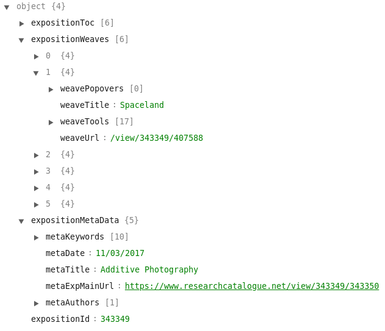

# Expositions as Digital Objects

* Render an exposition in multiple ways
* Respond to display device
* Program the behavior of an exposition
* A format makes exposition independent from a single implementation
* Dynamic entity that can be connected to services, devices and other digital objects
* Ensure (long term) accessibility
* Extensibility 

# Graphical Expositions Now

* Structure (such as captions, columns, relationships, etc) are only recognizable visually
* Format is not specified but tied to the editor
* Cannot be processed, rendered differently, converted etc

# Parsing Graphical Expositions

* Algorithmically derive structure graphical expositions
* Different editors for creating exposition objects
* Use position information 
* Written in *Haskell*
* [https://github.com/SocietyForArtisticResearch/parse-exposition](https://github.com/SocietyForArtisticResearch/parse-exposition)

# Parsing Graphical Expositions

{ width=60% }

# Transforming Graphical Expositions

* epub conversion
* Markdown conversion
* Mobile view

# Potential Uses and Applications

* Conversion to/from established document formats
* Transfer between editors
* Implementation of new editors for graphical expositions
* Collecting metadata and analyzing expositions 
* Archiving
* Dynamic rendering and programmable structures
* Copyediting
* External version control

# Networks of Digital Objects on the RC

* Create links between expositions and works
* Dynamically create expositions with content from other expositions
* Create pages around key words with works and (parts of) expositions
