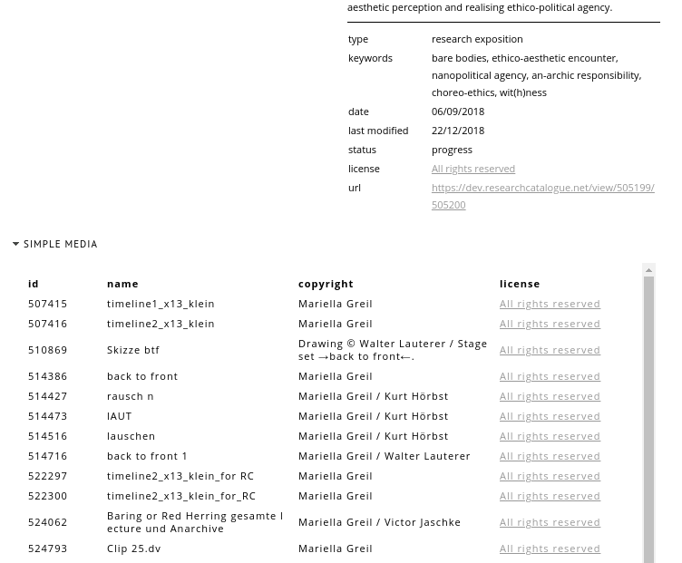
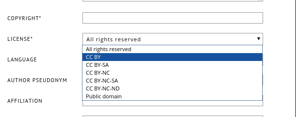

# Word Import

# Metadata / Licenses

* Co-authors no longer publicly marked as co-authors. 
* Licenses (All rights reserved, CC, public domain etc.) for media
* Import of license information from Madek
* Copyright and licence for expositions

# Licenses on Details Page

{ width=65% }

# Licenses for Exposition

{ width=65% }

# Importing HTML

Allows user to upload a zip file of HTML, media and stylesheets.

* Needs to be a flat folder (currently no nested structures).
* Any media will be automatically transcoded.
* Starting point is called index.html.

# New Text-based Editor 

* Complete reimplementation of the text-based editor
* Written in the functional language *Elm*
* [https://github.com/SocietyForArtisticResearch/texteditor-elm](https://github.com/SocietyForArtisticResearch/texteditor-elm)
* Easier to maintain and to extend, less dependencies 
* More elegant, efficient and robust technical design
* Prepared for upcoming developments of editor(s)
